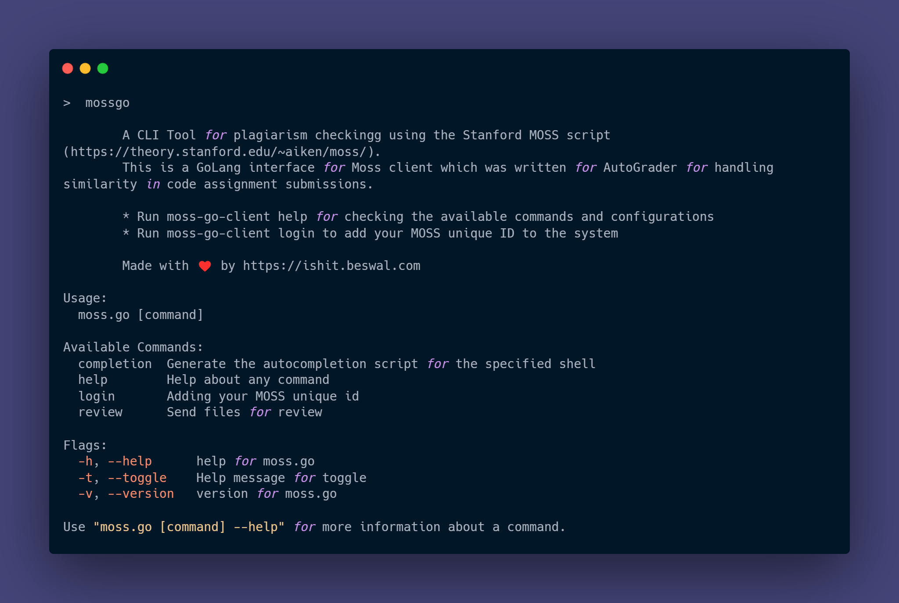

<h1 align="center">💻 MOSS Plagiarism Checker CLI</h1>
`mossgo`: A CLI Tool for Stanford MOSS plagiarism tool made in GoLang



---
# Contents
- [Introduction](#introduction)
- [Registering for MOSS](#registering-for-moss)
- [Commands](#commands)
    - [Language](#language)
    - [Directory](#directory)
    - [BaseFile](#basefile)
    - [Max Similarities](#max-similarities)
    - [Comment](#comment)
    - [Number of Files to Match](#number-of-files-to-match)
    - [Experimental Mode](#experimental-mode)
- [Installation Instructions](#installation-instructions)
- [Build from Source](#build-from-source)

## Introduction
This is a CLI client for the [MOSS plagiarism tool](https://theory.stanford.edu/~aiken/moss/), written in Go. Moss (for a Measure Of Software Similarity) is an automatic system for determining the similarity of programs. Moss is being provided as an Internet service, which is called upon through this client CLI.

In response to a query the Moss server produces HTML pages listing pairs of programs with similar code. Moss also highlights individual passages in programs that appear the same, making it easy to quickly compare the files. Finally, Moss can automatically eliminate matches to code that one expects to be shared (e.g., libraries or instructor-supplied code), thereby eliminating false positives that arise from legitimate sharing of code. The CLI returns the URL to this result on a review.

Please click [here](https://theory.stanford.edu/~aiken/moss/) for more information on MOSS.

## Registering for MOSS
To obtain a Moss account, send a mail message to moss@moss.stanford.edu. The body of the message should appear exactly as follows:
```
registeruser
mail username@domain
```

You will receive an automated response after a while, which contains the [Perl client script](http://moss.stanford.edu/general/scripts.html) to run MOSS. In between the code you will find your unique ID written as such:
`$userid=987654321;`
Copy this user ID and use it to login to the CLI.

## Commands

### Help
To see details of all available commands
```bash
mossgo <COMMAND> help
```

### Login
To save the MOSS user ID as creds in a local file.
```bash
mossgo login
```

### Review
Usage: 
```bash
moss [-l|--language language] [-d|--directory] [-b|--basefile basefile1] ... [-b|--basefile basefileN] [-m 10] [-x|--experimental] [-n|--show 250] [-c "string"] file1 file2 file3 ...
```

> If you haven't logged in, the CLI will ask you to enter your user ID.

#### <strong>Language</strong>
The -l|--language option specifies the source language of the tested programs. Moss supports many different languages; see below for the full list.
>- c
>- cc
>- java
>- ml
>- pascal
>- ada
>- lisp
>- scheme
>- haskell
>- fortran
>- ascii
>- vhdl
>- perl
>- matlab
>- python
>- mips
>- prolog
>- spice
>- vb
>- csharp
>- modula2
>- a8086
>- javascript
>- plsql
>- verilog
_Example_: Compare the lisp programs foo.lisp and bar.lisp:
```bash
moss -l lisp foo.lisp bar.lisp
```

#### <strong>Directory</strong>
The -d|--directory option specifies that submissions are by directory, not by file.
That is, files in a directory are taken to be part of the same program, and reported matches are organized accordingly by directory.
<br>
<br>
_Example_: Compare the programs foo and bar, which consist of .c and .h
files in the directories foo and bar respectively.
```bash
moss -d foo/*.c foo/*.h bar/*.c bar/*.h
```
    
_Example_: Each program consists of the *.c and *.h files in a directory under the directory "assignment1."
```bash
moss -d assignment1/*/*.h assignment1/*/*.c
```

#### <strong>Basefile</strong>
The -b option names a "base file". When a base file is supplied, program code that also appears in the base file is not counted in matches.
A typical base file will include, for example, the instructor-supplied source code
<br>
`IMPORTANT`: Unlike previous versions of moss, the -b option *always* takes a single filename, even if the -d option is also used.
<br>
<br>
_Example_: Submit all of the C++ files in the current directory, using skeleton.cc as the base file:
```bash
moss -l cc -b skeleton.cc *.cc
```

_Example_: Submit all of the ML programs in directories asn1.96/* and asn1.97/*, where asn1.97/instructor/example.ml and asn1.96/instructor/example.ml contain the base files.
```bash
moss -l ml -b asn1.97/instructor/example.ml -b asn1.96/instructor/example.ml -d asn1.97/*/*.ml asn1.96/*/*.ml
```

#### <strong>Max Similarities</strong>
The -m|--maxSimilarities option sets the maximum number of times a given passage may appear
before it is ignored.  A passage of code that appears in many programs
is probably legitimate sharing and not the result of plagiarism.  With -m N,
any passage appearing in more than N programs is treated as if it appeared in 
a base file (i.e., it is never reported). The default for -m is 10.
_Examples_:
```bash
moss -l pascal -m 2 *.pascal
```
```bash
moss -l cc -m 1000000 -b mycode.cc asn1/*.cc
```

#### <strong>Comment</strong>
The -c option supplies a comment string that is attached to the generated
report.
_Example_:
```bash
moss -l scheme -c "Scheme programs" *.sch 
```

#### <strong>Number of Files to match</strong>
The -n option determines the number of matching files to show in the results.
The default is 250.
_Example_:
```bash
moss -c java -n 200 *.java
```

#### <strong>Experimental Mode</strong>
The -x option sends queries to the current experimental version of the server.
_Example_:
```bash
moss -x -l ml *.ml
```

## Installation Instructions
Download the binary from [releases](https://github.com/ishitb/moss.go/releases)
>- Download the executable for your platform
>- Add the path to your executable to the `PATH` variable
>- Execeute `mossgo` from your commanf line.

## Build from Source
### Pre-requisites
[Go](https://golang.org/)

### Steps
- Clone the repository on your system
```bash
git clone https://github.com/ishitb/moss.go.git
```
or using `SSH`
```bash
git clone git@github.com:ishitb/moss.go.git
```

#### Using executable
- Build an executable for your system
```bash
go build -o bin/
```

- Run the executable from the directory you cloned the repository in
```bash
./bin/mossgo
```

#### Edit and Run the CLI
```bash
go run main.go
```

---
<p align="center">
Made by 
<br>
<a href="https://github.com/ishitb">
<br />
</a>
with ☕ and ❤️.
</p>